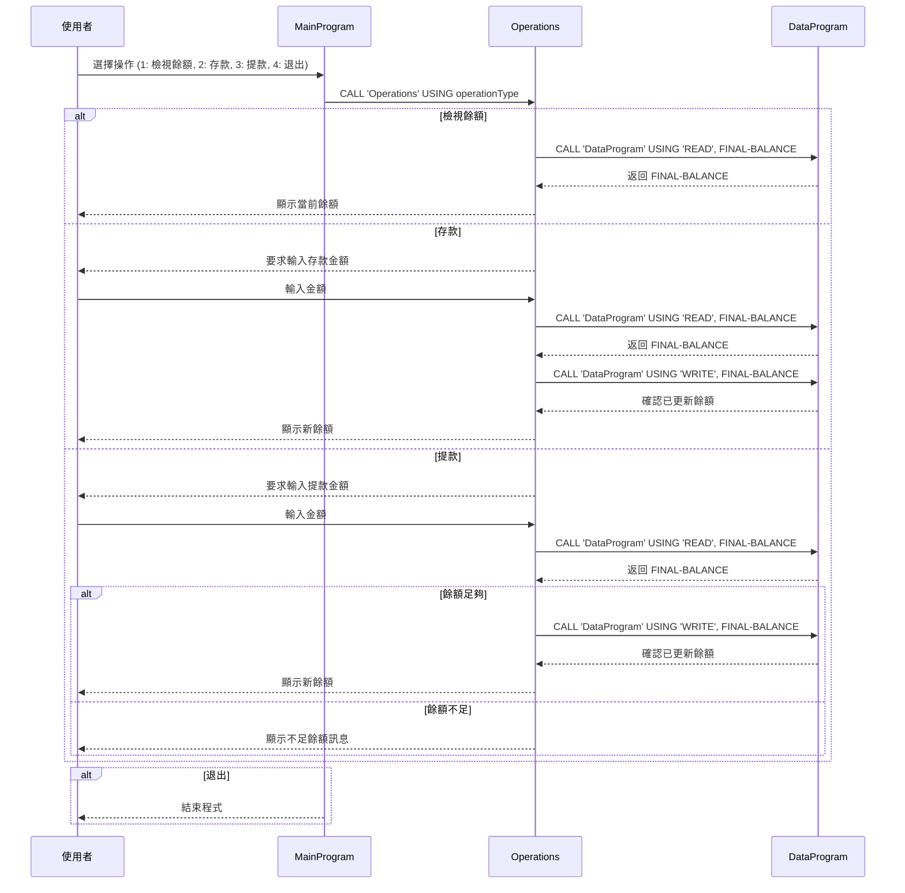

# COBOL 程式碼說明

此資料夾說明專案中 `src/cobol` 下各 COBOL 檔案的用途、關鍵功能，以及與學生帳戶相關的業務規則。

## 檔案說明

### `src/cobol/main.cob`
- 主要程式入口。
- 顯示帳戶管理選單，提供以下操作：
  - 檢視餘額
  - 存入帳戶
  - 提款
  - 退出程式
- 讀取使用者選項並呼叫 `Operations` 模組執行對應操作。
- 對無效選項顯示錯誤提示。

### `src/cobol/operations.cob`
- 處理帳戶操作邏輯。
- 根據呼叫參數決定操作類型：
  - `TOTAL`：讀取並顯示當前餘額。
  - `CREDIT`：要求使用者輸入存款金額，讀取目前餘額後新增金額，並寫回儲存模組。
  - `DEBIT`：要求使用者輸入提款金額，讀取目前餘額後檢查是否足夠，若足夠則扣款並寫回儲存模組。
- 使用 `CALL 'DataProgram'` 進行資料讀寫。

### `src/cobol/data.cob`
- 資料儲存和讀取模組。
- 以 `STORAGE-BALANCE` 保留帳戶餘額狀態，初始值為 `1000.00`。
- 支援兩種操作模式：
  - `READ`：將儲存餘額傳回呼叫方。
  - `WRITE`：接收新的餘額並更新儲存值。
- 這個模組負責維持單一帳戶的當前金額。

## 關鍵功能

- 單一入口選單驅動的互動式帳戶管理。
- 分離業務邏輯與資料存取：`Operations` 處理交易流程，`DataProgram` 處理餘額讀寫。
- 基本帳戶交易規範：存款、提款、查餘額。

## 與學生帳戶相關的業務規則

- 帳戶初始餘額為 `1000.00`。
- 提款前須先檢查帳戶是否有足夠餘額；若不足，交易失敗並顯示 `Insufficient funds for this debit.`。
- 帳戶餘額變動後會寫回資料儲存模組，保持最新狀態。
- 程式目前僅管理單一帳戶，尚未包含學生身分識別或多帳戶管理。
- 如果此系統用於學生帳戶，則目前的業務規則適用於單一學生帳戶的基本存提款流程。

## 資料流序列圖

